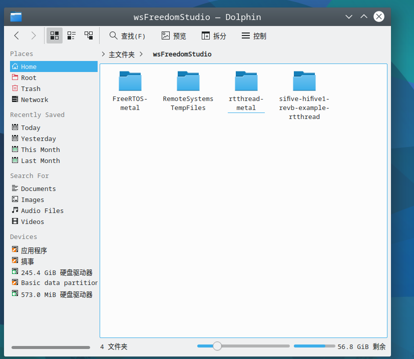
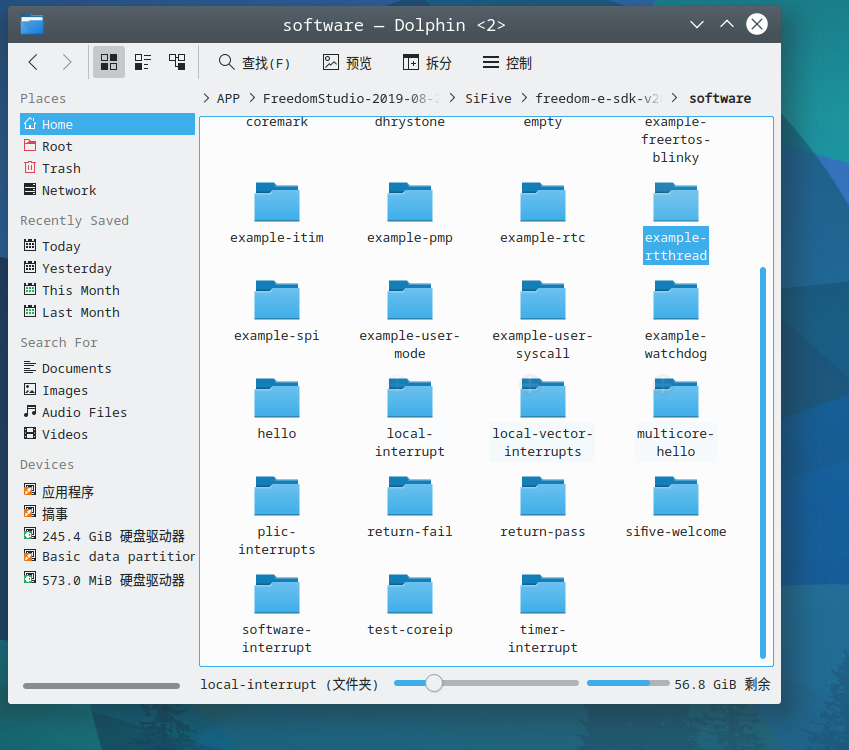
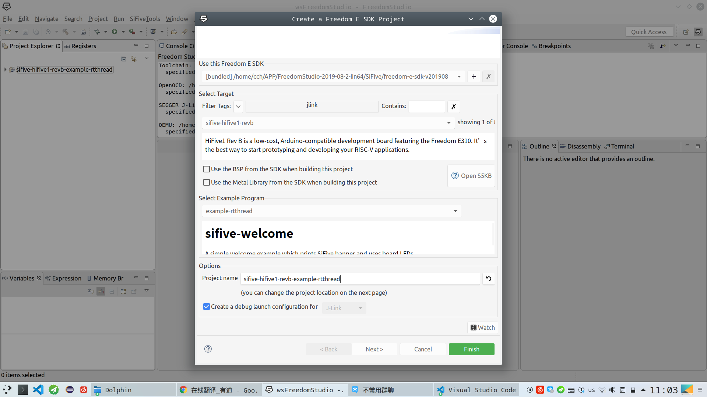

# RT-Thread source for freedom-e-sdk
源码来自rtthread官方repository https://github.com/RT-Thread/rtthread-nano.git, 在rtthread-nano(v3.1.3)基础上添加修改了RISC-V的相关文件，使其可以与freedom-e-sdk一同使用。
rtthread.mk帮助将rtthread添加到任意的例程中。

# Quick Start
* 1.将 rtthread-metal添加到你使用的 freedom-e-sdk和 Freedom Studio的 workspace中。

* 2.将例程 example-rtthread添加到 freedom-e-sdk/Software目录下。

* 3.使用 Freedom Stuido导入example-rtthread到工作空间。


# DirTree
```
├─rtthread.mk - - - - - - -包含需要编译的文件
├─rtthread-nano
|       ├─src - - - - - - -rtthread源文件
|       ├─libcpu
|       |   ├─risc-v - - - - -RISC-V的相关文件
|       ├─include - - - - - rtthread头文件
|       ├─finsh - - - - - - finsh组件(可选的)
```
# Note
1.RISC-V的相关支持文件位于 ./rtthread-nano/libcpu/risc-v目录下。修改了和添加了原来rtthread-nano的risc-v支持文件，以使rtthread-metal能与freedom-metal一起使用。包括:
* 修改了risv-plic.h中 PLIC_BASE_ADDR 的定义：
```c
#include <metal/machine.h>

#ifndef PLIC_BASE_ADDR
#define PLIC_BASE_ADDR METAL_RISCV_PLIC0_0_BASE_ADDRESS
#endif

```
* 添加metal_start_gcc.S。添加此文件编译后，会替换掉freedom中默认的.secondary_main函数。此函数规定了C语言的入口，原来入口是main(),替换为rtthread规定的函数入口entry()。
```
1:
  wfi
  j 1b
2:
  call entry
```
2.rtthread配置文件rtconfig.h和板级支持文件board.c放在例程目录中，是rtthread-metal支持不同的risc-v CPU。


# License
```
/*
 * Copyright (c) 2006-2018, RT-Thread Development Team
 *
 * SPDX-License-Identifier: Apache-2.0
 */
```